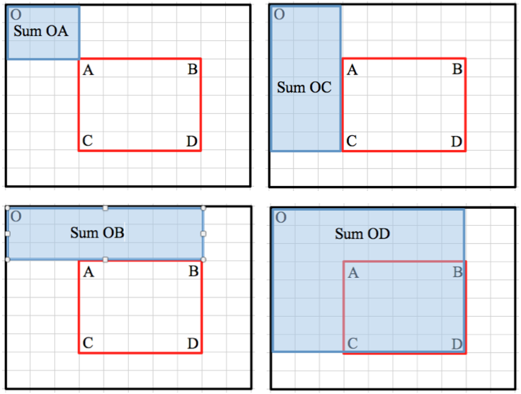

### [1292.Maximum-Side-Length-of-a-Square-with-Sum-Less-than-or-Equal-to-Threshold](https://leetcode.com/problems/maximum-side-length-of-a-square-with-sum-less-than-or-equal-to-threshold/)

#### Solution 1: binary search + prefix sum

For such problem, the brute force solution would be O(n<sup>4</sup>m) (where n is the shorter side). It would be O(mn) to iterate every possible upper left corner, O(n) possible length and O(n<sup>2</sup>) for iterating all possible cells in the squares. Actually the last two would be O(1<sup>2</sup> + 2<sup>2</sup> + 3<sup>2</sup> + ... + n<sup>2</sup>) = O(n(n+1)(2n+1)/6) = O(n<sup>3</sup>). A little improvement would be only compute the diff between the small square to the square by increasing the side by 1. That would gives O(n<sup>3</sup>m).

Potential solutions for such problem are greedily construct such sqaure, dynamic programing and binary search. The first two seems not apply to this problem. There is no obvious way for greedy to construct and it is hard to define the optimal subproblems for dp. On the hands, please note the minimum sum of squares is non-decreasing as the length increased because we only have non-negative integer in the matrix so we can perform the binary search. This problem asks for maximum side. If it asks for minimum side, it can be done by greedy because if there exists one it must with length 1. The max is a little completed. To get the max in a non-decreasing sequence. We would track the lower bound with max valid value and push it to the max. Similarily, for minimum, we can track the upper bound with min valid value to push it lower. You can check the following for the maximum. The boundary is also clear. It would be 0 and minimum of the two sides in the original matrix because the target is a square.

```java
    while (lo < hi) {
        int mid = hi - (hi - lo)/2;
        if (getMinSum(mat, mid) <= threshold) {
            lo = mid;
        } else {
            hi = mid - 1;
        }
    }
```

In this problem, getMinSum would find the smallest sum with length mid. Clearly, a valid value would make the result of getMinSum less than or equal to threshold.

The thing is computation based on mat is not efficeint. We actually can do it in O(1) instead of O(n<sup>2</sup>). The 2D prefix sum matrix is the cure.



From the image, obtained [here](http://www.ardendertat.com/2011/09/20/programming-interview-questions-2-matrix-region-sum/), we know `sumOD = sumOB + sumOC - sumOA + sum of ABCD` and `sum of ABCD = sumOD - sumOB - sumOC + sumOA`. These two equations would help us generate and query the prefix sum matrix.

For generation, we currently own know mat[i][j]. So our sum of ABCD is the single cell only. `preSum[i][j] = preSum[i-1][j] + preSum[i][j-1] - preSum[i-1][j-1] + mat[i][j]`. And to query square (i, j), (k,z) we have `sum of i-j-k-z = preSum[k][z] - preSum[i-1][z] - preSum[k][j-1] + preSum[i-1][j-1]`. As you might noticed, i - 1 and j -1 might be negative. For the ease of implementation, we can add one additional column and one additional row to avoid dealing with the boundary condition like 1D prefix sum array. Howerver, that means, preSum[i][j] is the sum of (0,0) to (i-1, j -1) in the matrix. 

```java
    private int[][] genPreSum(int[][] mat) {
        final int M = mat.length;
        final int N = mat[0].length;
        int[][] preSum = new int[M+1][N+1];
        for (int i = 0; i < M; ++i) {
            for (int j = 0; j < N; ++j) {
                preSum[i+1][j+1] = preSum[i][j+1] + preSum[i+1][j] - preSum[i][j] + mat[i][j];
            }
        }
        return preSum;
    }
```

we now can use preSum instead of mat. `if (getMinSum(preSum, mid) <= threshold) {`

```java
    private int getMinSum(int[][] preSum, int len) {
        if (len == 0) {
            return 0; 
        }
        final int M = preSum.length;
        final int N = preSum[0].length;
        int ans = Integer.MAX_VALUE;
        for (int i = 0; i < M - len; ++i) {
            for (int j = 0; j < N - len; ++j) {
                ans = Math.min(ans, preSum[i+len][j+len] - preSum[i][j+len] - preSum[i+len][j] + preSum[i][j]);
            }
        }
        return ans;
    }
```

We can improve this a little better. We actually does not care getMinSum. Instead, we only care if we can get a sum of a square with mid as length <= threshold. It does not have to be the minimum. That means we can stop early in the getMinSum. So, we can have   `if (containsLessThanOrEqualSum(preSum, mid, threshold)) {` insead of `if (getMinSum(preSum, mid) <= threshold) {`.

```java
    private boolean containsLessThanOrEqualSum(int[][] preSum, final int len, final int threshold) {
        if (len == 0) {
            return true; 
        }
        final int M = preSum.length;
        final int N = preSum[0].length;

        for (int i = 0; i < M - len; ++i) {
            for (int j = 0; j < N - len; ++j) {
                if (preSum[i+len][j+len] - preSum[i][j+len] - preSum[i+len][j] + preSum[i][j] <= threshold) {
                    return true;
                }
            }
        }
        return false;
    }
```