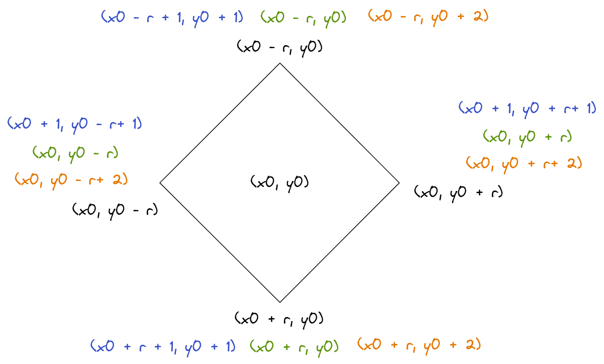

### [1878.Get-Biggest-Three-Rhombus-Sums-in-a-Grid](https://leetcode.com/problems/get-biggest-three-rhombus-sums-in-a-grid/)

#### Solution 1: Brute Force

The size of data is 50 * 50. We can resolve this question by brute force. The idea is to try all possible rhombuses and go along the side to get the sum. To iterate the rhombuses, there are many ways. I would prefer to try all possible centers. From the center, we can get the four corner points by iterating all possible length and once we hit any of boundaries of the square we can stop and try the next and it is very easy to compute the four points with a given center. So to iterate the center, it costs O(mn) where m and n are the two dimensions. For each center, we need to go over all possible diagonal (iterating over half of the diagonal) of the rhombus. And the number of cells along the perimeter is proportional to the diagonal. So we would have O(m<sup>3</sup>n) assuming m is the smaller side. 

In my implementation, to compute each side, the ending point is not considered so that during the four computation of the side would not contain overlap. To update the answer, we need check if there is duplicate. Please note when the rhombus is a single point, we would still count it 4 times so instead of computing from length 0, we compute the half length of rhombus diagonal from 1 and check grid[i][j] directly for the single point case. 
```java
    private int getSumSideBF(int[][] grid, int xStart, int yStart, int xEnd, int yEnd, int dx, int dy) {
        int ans = 0;
        // the end point is not included so that it would not overlap with another call
        /*
         int ans = getSumSideBF(grid, xu, y0, x0, yl, 1, -1);
         ans += getSumSideBF(grid, x0, yl, xd, y0, 1, 1);
         ans += getSumSideBF(grid, xd, y0, x0, yr, -1, 1);
         ans += getSumSideBF(grid, x0, yr, xu, y0, -1, -1);
        */
        while (xStart != xEnd && yStart != yEnd) {
            ans += grid[xStart][yStart];
            xStart += dx;
            yStart += dy;
        }
        return ans;
    }
``` 

```java
    private void update(int[] ans, int cand) {
        // if the candidates is less than or equal to the last, there is no impact on top 3.
        if (cand <= ans[2]) {
            return;
        }

        if (cand > ans[0]) {
            //if candidate is greater than the observed largest
            // copy the observed larget to the next only if there are different
            if (ans[0] > ans[1]) {
                // the same for the 2nd largest and the 3rd largest
                if (ans[1] > ans[2]) {
                    ans[2] = ans[1];
                }
                ans[1] = ans[0];
            }
            ans[0] = cand;
        } else if (cand < ans[0] && cand > ans[1]) {
            if (ans[1] > ans[2]) {
                ans[2] = ans[1];
            }
            ans[1] = cand;
        } else if (cand < ans[1]) {
            ans[2] = cand;
        }
    }
``` 


#### Solution 2: PreSum

Brute Force is working. But it can be easy to figure out we can reduce the time complexity by introducing presum matrices for the major diagonal and minor diagonal. Then for each side, we can compute the sum of a side in a rhombus by taking the difference in the presum matrices. To avoid dealing with boundaries and to make easy to accross the major diagonal matrix and minor diagonal matrix, I intialize them as int[m+2][n+2]. so the preSumMajor[i+1][j+1] means the sum on the major diagonal from the start to the entry (i, j). Please note it is also possible to map the diagonal according to the sum of i and j ( in major diagonal or i - j in min diagonal) but it would be hard to find index of sum ended at entry (i, j) in the diagonal presum list or presum array. So we just use the int[m+2][n+2] instead.

For the major diagonal presum, `preSumMajor[i+1][j+1] = preSumMajor[i][j] + grid[i][j]`. For the minor diagonal, in order to make the indices consisten, we can define it as `preSumMinor[i+1][j+1] = preSumMinor[i][j+2] + grid[i][j]`.

The only thing we need change to compute the sum of the sides. For a given center (x0, y0) and the half of the diagonal of the rhombus r (not the diagonal of the square), we have the for point (x0 - r, y0), (x0, y0 - r), (x0 + r, y0) (x0, y0 + r).

The above shows the coordinates of rhombus in black. The blue one map them to the preSumMajor matrix and preSumMinor Matrix. The green one is the previous index on preSum major. It add (-1, -1) for the index in preSumMajor matrix. The orange one is the previous index in preSumMinor Matrix. It adds (-1, +1) to the index in preSumMinor index.

In the computing, we do not include the end point. For example from (x0, y0 - r) to (x0 -r, y0). The side is on minor diagonal. (x0, y0 - r) is the later point on the diagonal. We need skip it to avoid adding it twice. So we need to previous point in the minor diagonal. That is (x0, y0 - r + 2). For the start, we need include it, so we also need to previous point (x0 - r, y0 + 2). So the sum is `preSumMinor[x0][y0 - r + 2] - preSumMinor[x0 - r][y0 + 2]`

Let's check again for (x0 - r, y0) and (x0, y0 + r). This point is on major diagonal. Because we already compute (x0 - r, y0) in previous iteration. We need to exclude it and include (x0, y0 + r). In the major matrix, it starts at (x0 - r, y0) and ended at (x0, y0 + r). So we need to get sum of (x0 - r + 1, y0 + 1) to (x0, y0 + r). They map to the preSumMajor matrix as (x0 - r + 1 + 1, y0 + 1 + 1) and (x0 + 1, y0 + r +1). The sum is `preSumMajor[x0 + 1][y0 + r +1] - preSumMajor[x0 - r + 1 + 1 - 1][y0 + 1 + 1 - 1]` or `preSumMajor[x0 + 1][y0 + r +1] - preSumMajor[x0 - r + 1][y0 + 1]`
