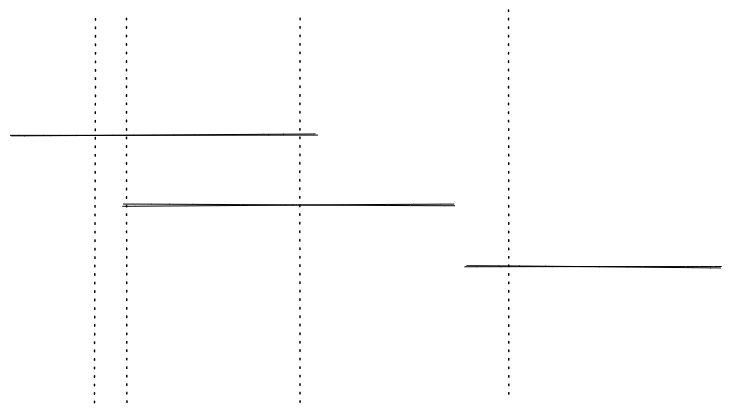

### [732.My-Calendar-III](https://leetcode.com/problems/my-calendar-iii/)

#### Solution 1: Line Sweep

It is only 400 calls. So we can use a simple method line weep. For each event, we can think them as a line on the calender from the start time to the end (exclusive). The line sweep algorithm would draw a virtual vertical line for every time point and check how many event lines it cross. Our target is the maximum event line crossed. But the event spread sparsely. It from 0 to 109. It would time out if we make an array and make the time their. Please note the only monents the number of crossed event line changed are at the ends of the line, either start or the end. So the problem become how to efficiently iterate over those points by time order. We can use a TreeMap. It is not only sort the event by time, we can also record the number of crossed lines changed at a point as its value. For example, if two lines start at 3, we would record 2. If one line ends at 3 and one line starts at 3, we would record 0 because it doest not change the line crossed by the vertical line.

So every time, we update the changed count in the tree map. to add 1 at the start time and minus 1 at the end time. Then, we can go over the event time point to figure out the max event line crossed. Please note in this problem the end time is excluded. If it included, we can minus 1 at the end time + 1.

#### Solution 2: Segment Tree
