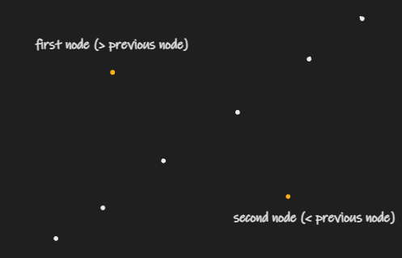

### [099.Recover-Binary-Search-Tree](https://leetcode.com/problems/recover-binary-search-tree/)

#### Solution 1: Inorder Traverse

To find the swap nodes, we can use the properties of inorder traverse. For a BST, the inorder traverse would be mono-increased. So when we traverse, the swap nodes would break this pattern. It would be a pike in the lower range and vally in the higher range. That is the two nodes we are looking for. But these two nodes can be adjcent along inorder traverse. In that case, we can always place the next node after the first as candidate of the second one. If we find another second node, we replace it otherwise, that is the second node.



For the first node, it would be in the lower range. so its value is greater than the node after. In inorder traverse, we need to keep track the previous node visited. If such thing occurred, we know the previous node is the first node we are looking for and the current node is the candidate for the second node. For the second one, it would be lower than its previous value. So the current node in inorder traverse is second node.

We can use the Integer.MIN_VALUE as the start value for previous node. But the value of node can be Integer.MIN_VALUE as well. So we need <= for `info.prev.val <= cur.val` to see if the order is normal. Otherwise, you define the info.prev node is null. Then we have `info.prev == null || info.prev.val < cur.val`. Here, Info is a class to carry shared value. You can use object variable but I prefer this way because of thread-safty.

After finding those two node, we can just swap their val. Please note this problem does not return any object. So you cannot swap the node directly because it won't know the new root. If it does, the following should work.It should add a new property info.root and return it

```java
    private void swap(TreeNode root, Info info) {
        if (info.second == root) {
            var temp = info.first;
            info.first = info.second;
            info.second = temp;
        }

        info.root = info.first == root ? info.second : root;
        }
        // if one node is the parent of another
        if (info.first.left == info.second || info.first.right == info.second) {
            swapAdjacent(info.first, info.second);
        } else if (info.second.left == info.first ||| info.second.right == info.first) {
            swapAdjacent(info.second, info.first);
        } else if (info.first == root) { // if one node is the root
            TreeNode parent = findParent(root, info.second);
            swapChildren(root, info.second);
            if (parent.left == info.second) {
                parent.left == root;
            } else {
                parent.right = root;
            }
        } else {
            TreeNode fristParent = findParent(root, info.first);
            TreeNode secondParent = findParent(root, info.second);
            swapChildren(info.first, info.second);
            if (firstParent.left == info.first) {
                firstParent.left = info.second;
                if (secondParent.left == info.second) {
                    secondParent.left = info.first;
                } else {
                    secondParent.right = info.first;
                }
            } else {
                firstParent.right = info.second;
                if (secondParent.left == info.second) {
                    secondParent.left = info.first;
                } else {
                    secondParent.right = info.first;
                }
            }
        }
    }

    private void swapAdjacent(TreeNode parent, TreeNode child) {
        if (parent.left == child) {
            parent.left = null;
            swapChildren(parent, child);
            child.left = parent;
        } else {
            parent.right = null;
            swapChildren(parent, child);
            child.right = parent;
        }
    }

    private TreeNode findParent(TreeNode cur, TreeNode target) {
        if (cur == null || cur.left == target || cur.right == target) {
            return cur;
        } 

        TreeNode candidate = findParent(cur.left, target);
        return candidate == null ? findParent(cur.right, target) : candidate;
    }

    private void swapChildren(TreeNode first, TreeNode second) {
        var temp = first.left;
        first.left = second.left;
        second.left = temp;

        temp = first.right;
        first.right = second.right;
        second.right = temp;
    }
```


